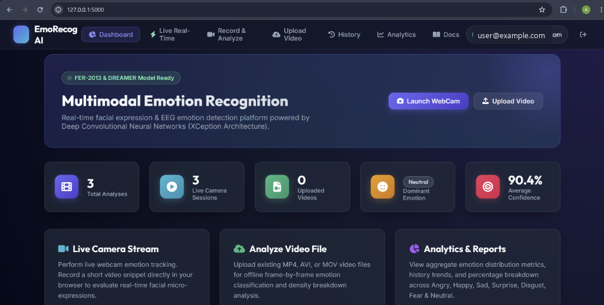
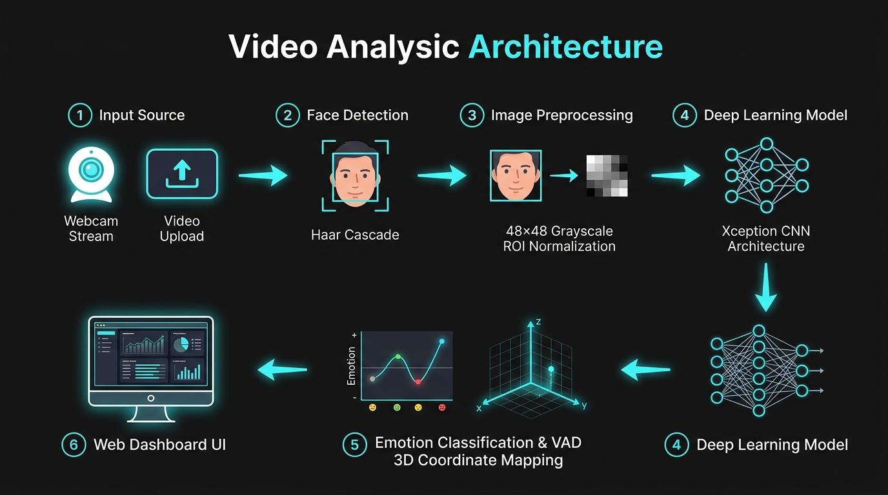
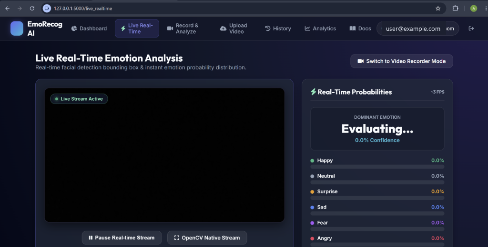
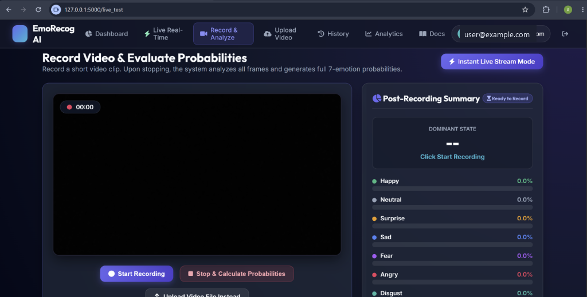
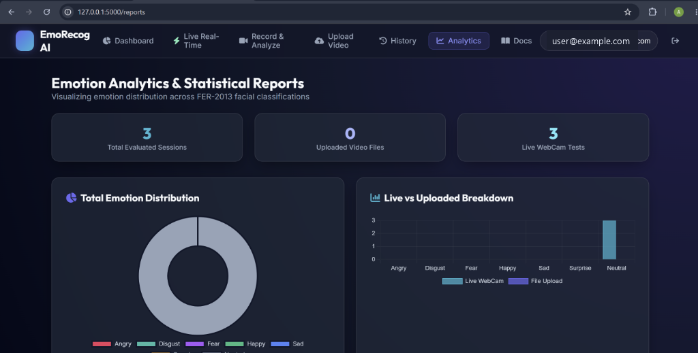
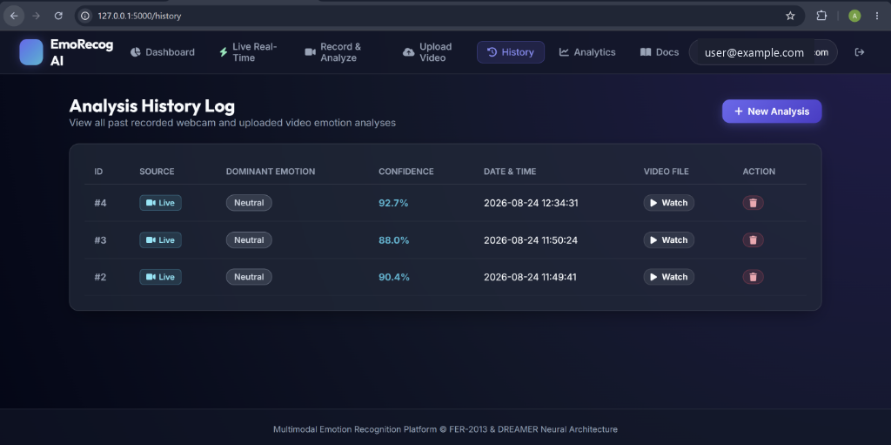

# 🧠 Multimodal Emotion Recognition (FER2013 & DREAMER)

<p align="center">
  <a href="https://multimodal-emotion-recognition-fer2013.onrender.com" target="_blank">
    
  </a>
  <a href="https://github.com/anilhosalli18/Multimodal-Emotion-Recognition--FER2013-DREAMER-">
    
  </a>
</p>

> 🌐 **Live Web Application**: [**https://multimodal-emotion-recognition-fer2013.onrender.com**](https://multimodal-emotion-recognition-fer2013.onrender.com)

A state-of-the-art deep learning platform for **Multimodal Emotion Recognition**, integrating facial expressions from the **FER2013 dataset** and physiological signals (EEG & ECG) from the **DREAMER dataset**. The project features an interactive Flask-based Web Application designed for real-time webcam emotion analytics, video file processing, session reporting, and Valence–Arousal–Dominance (VAD) psychological mapping.

---

<p align="center">
  <a href="https://multimodal-emotion-recognition-fer2013.onrender.com" target="_blank">
    
  </a>
</p>

---

## 📋 Table of Contents
- [✨ Key Features](#-key-features)
- [🛠️ Technologies Used](#️-technologies-used)
- [📊 Datasets & Models](#-datasets--models)
- [🔄 Pipeline & System Architecture](#-pipeline--system-architecture)
- [🖥️ UI Modules & Screenshots](#️-ui-modules--screenshots)
- [🚀 Quick Start & Installation](#-quick-start--installation)
- [📂 Project Structure](#-project-structure)
- [📜 License](#-license)

---

## ✨ Key Features

- **Real-Time Webcam Streaming**: Instant facial emotion classification and live probability bar charts directly in the browser (`/live_realtime`).
- **Webcam Clip Recording**: Record video clips and calculate full 7-emotion probabilities upon completion (`/live_test`).
- **Video File Uploads**: Process offline video files (`.mp4`, `.avi`, `.mov`, `.webm`) with multi-face detection.
- **Valence–Arousal–Dominance (VAD) Mapping**: Translates discrete emotions into 3D emotional space (Positivity, Intensity, Confidence).
- **Analytics & Statistical Reports**: Comprehensive donut charts, total session counts, and live vs. upload breakdowns (`/reports`).
- **Analysis History Log**: Detailed log tracking past evaluations, timestamps, confidence scores, and video playback controls (`/history`).
- **User Authentication**: Account management with SQLite storage, registration, password hashing, and session persistence.

---

## 🛠️ Technologies Used

- **Core & Backend**: Python 3.9+, Flask, Werkzeug, SQLite3
- **Deep Learning & Computer Vision**: TensorFlow / Keras, OpenCV, Haar Cascades, Xception CNN Architecture
- **Data Science & Analytics**: NumPy, Pandas, Altair Visualization Library
- **Frontend**: HTML5, CSS3, JavaScript (ES6+), Jinja2 Templates

---

## 📊 Datasets & Models

### 📁 Datasets Overview

| Dataset Name | Modality | Data Type | Description | Usage |
| :--- | :--- | :--- | :--- | :--- |
| **FER2013** | Facial Expressions | Grayscale Images ($48 \times 48$) | $35,887$ labeled images across 7 emotion classes | Visual feature extraction & CNN classifier training |
| **DREAMER** | Physiological Signals | EEG (14 ch) & ECG (2 ch) | Multimodal biosignal dataset from 23 participants | VAD regression & physiological feature alignment |

* **FER2013 on Kaggle**: [FER2013 Dataset](https://www.kaggle.com/datasets/msambare/fer2013)
* **DREAMER on Zenodo**: [DREAMER Dataset](https://zenodo.org/records/546113)

### 🤖 Model Architectures

| Model Name | Modality | Target / Purpose | Framework |
| :--- | :--- | :--- | :--- |
| **Xception CNN** | Facial Images | 7 Discrete Emotion Classes (*Angry, Disgust, Fear, Happy, Sad, Surprise, Neutral*) | TensorFlow / Keras |
| **1D-CNN & ML Regressors** | EEG & ECG | Continuous VAD (Valence, Arousal, Dominance) Scores | Scikit-learn / TensorFlow |
| **Multimodal Fusion Engine** | Visual + Biosignals | Combined Decision-level & Feature-level Emotion Fusion | Custom Pipeline |

---

## 🔄 Pipeline & System Architecture

<p align="center">
  
</p>

### ⚙️ Processing Workflow

1. **Input Capture**: Receives live webcam video streams or uploaded video files.
2. **Face Detection & Preprocessing**:
   - Detects faces using Haar Cascade Classifiers and multi-scale detection.
   - Crops, normalizes, and resizes the Region of Interest (ROI) to $48 \times 48$ grayscale dimensions.
3. **Deep Learning Inference**:
   - Passes ROI through the pre-trained Xception CNN model.
   - Applies Softmax activation to generate probability vectors across 7 emotion categories.
4. **VAD Interpretation**:
   - Maps predicted emotions to 3D Valence–Arousal–Dominance psychological coordinates.
5. **Database Storage & Visualization**:
   - Records session metrics, average face counts, dominant emotion label, probability distributions, and video paths into SQLite (`users.db`).

---

## 🖥️ UI Modules & Screenshots

### 1. Live Real-Time Emotion Analysis (`/live_realtime`)
Instant live webcam emotion probability stream with facial bounding box overlays.
<p align="center">
  
</p>

### 2. Video Recording & Evaluation (`/live_test`)
Record video snippets directly in the browser and receive complete 7-emotion probability summaries upon completion.
<p align="center">
  
</p>

### 3. Analytics & Statistical Reports (`/reports`)
Visual analytics displaying emotion distributions, session breakdowns, and mode comparisons.
<p align="center">
  
</p>

### 4. Analysis History Log (`/history`)
Comprehensive history dashboard storing evaluation sessions, timestamps, video files, and action controls.
<p align="center">
  
</p>

---

## 🚀 Quick Start & Installation

### 1. Prerequisites
- Python 3.9+ installed on your system.
- Git installed.

### 2. Clone the Repository
```bash
git clone https://github.com/anilhosalli18/Multimodal-Emotion-Recognition--FER2013-DREAMER-.git
cd Multimodal-Emotion-Recognition--FER2013-DREAMER-
```

### 3. Set Up Virtual Environment & Dependencies
```bash
# Create virtual environment
python -m venv env

# Activate virtual environment
# Windows:
env\Scripts\activate
# Linux/macOS:
source env/bin/activate

# Install required packages
pip install -r 04-WebApp/requirements.txt
```

### 4. Run the Flask Web Application
```bash
# Navigate to the WebApp directory
cd 04-WebApp

# Launch the application
python main.py
```

Open your browser and navigate to `http://127.0.0.1:5000` to access the application dashboard.

---

## 📂 Project Structure

```
Multimodal-Emotion-Recognition--FER2013-DREAMER-/
├── 01-runs/                     # Training runs, checkpoints, and model scalars
├── 02-Dataset/                  # Dataset utilities and processing scripts
├── 03-Video/                    # Video inference modules and models
├── 04-WebApp/                   # Main Flask Web Application
│   ├── library/                 # Core emotion recognition modules & preprocessing logic
│   ├── Models/                  # Trained model weights (video.h5) & cascade classifiers
│   ├── static/                  # CSS, JS, uploads, images, and documentation assets
│   ├── templates/               # Jinja2 HTML templates for WebApp pages
│   ├── main.py                  # Flask entry point and application routes
│   └── users.db                 # SQLite database for user sessions & recordings
├── .gitignore                   # Ignored files (virtualenv, pycache, user data)
└── README.md                    # Project documentation
```

---

## 📜 License

This project is licensed under the MIT License - see the [LICENSE](LICENSE) file for details.
